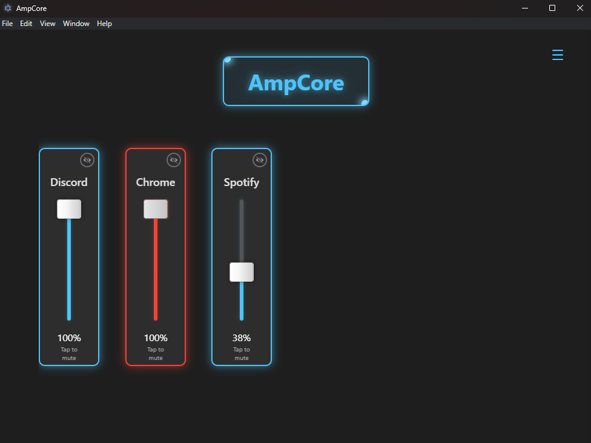
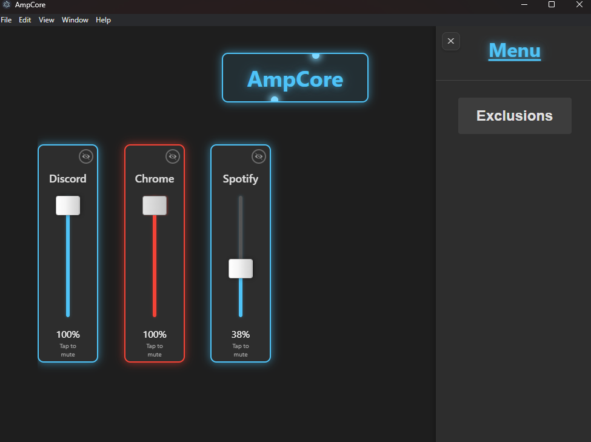
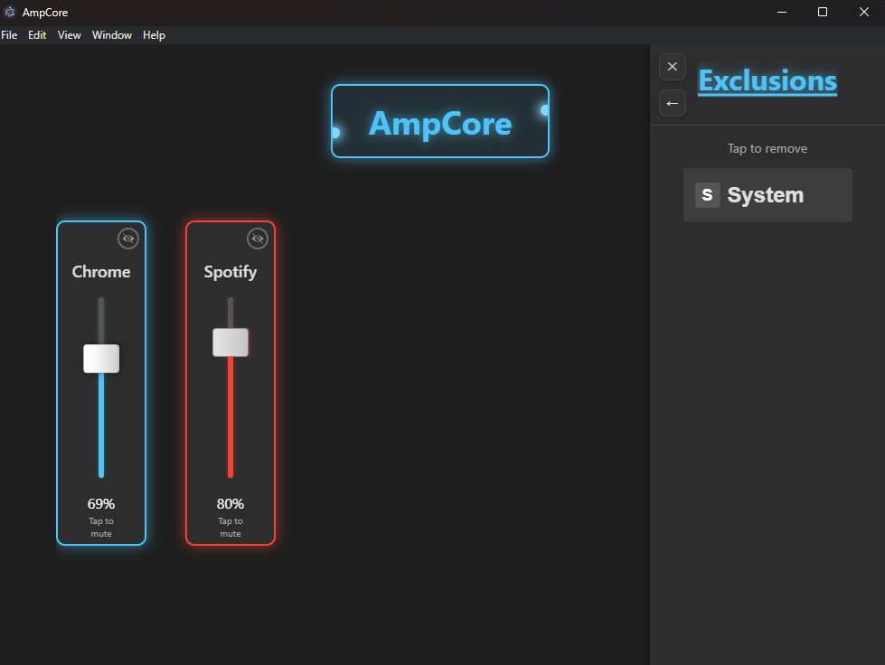

# AmpCore

<div align="center">


**A cross-platform desktop application for controlling audio volume at the application level**

[](LICENSE)
[](https://www.electronjs.org/)
[](https://nodejs.org/)
[](#platform-support)

</div>

## Overview

AmpCore gives users fine-grained control over audio on their system by providing individual volume controls for each application. It directly interfaces with platform-specific audio APIs through native code modules, offering a unified user experience across multiple operating systems.

## Features

- **Application-Level Volume Control**: Adjust the volume of individual applications independently
- **Real-time Audio Session Detection**: Automatically detects and displays active audio sources
- **System Tray Integration**: Controls accessible without interrupting workflow 
- **Cross-Platform Support**: Runs on Windows, macOS, and Linux
- **Persistent Settings**: User preferences for application visibility and mute states are saved
- **Intuitive UI**: Clean, modern interface with responsive controls

## Download Link

[AmpCore Installer](https://drive.google.com/file/d/11Fc-CXVuuRCuyZVCkDQoVyaAaEfftFDG/view?usp=drive_link)

## Screenshots

### Home Screen


### Menu Screen


### Exclusions Screen


## Platform Support

| Platform | Status | Implementation | API Used |
|----------|--------|----------------|----------|
| Windows | ✅ Full support | windows-audio-controller.cpp | Windows Core Audio API |
| macOS | ⚠️ Basic support | macos-audio-controller.mm | Core Audio |
| Linux | ✅ Full support | linux-audio-controller.cpp | PulseAudio |

## Architecture

AmpCore consists of:

1. **Electron Frontend**: HTML/CSS/JavaScript user interface
2. **Native Node.js Addons**: C++ modules that interface with OS-specific audio APIs
3. **IPC Bridge**: Communication layer between Electron and native components

```
Electron UI → IPC → Main Process → Node.js Bindings → Native Audio API
```

## Technology Stack

- **Frontend**: Electron, HTML5, CSS3, JavaScript
- **Backend**: Node.js, C++
- **Build System**: node-gyp, electron-builder
- **Audio APIs**:
  - Windows: MMDeviceEnumerator, IAudioSessionManager2, ISimpleAudioVolume
  - macOS: CoreAudio, AudioToolbox
  - Linux: PulseAudio (libpulse)

## Project Structure

```
AmpCore/
│
├── native-modules/            # Native code for OS audio control
│   ├── linux-audio-controller.cpp    # PulseAudio integration
│   ├── macos-audio-controller.mm     # CoreAudio integration
│   └── windows-audio-controller.cpp  # Windows audio integration
│
├── resources/                 # Application resources
│   ├── icon.ico               # Windows icon
│   ├── icon.icns              # macOS icon 
│   └── hide.svg               # UI icons
│
├── binding.gyp                # Native module build configuration
├── index.html                 # Main application UI
├── main.js                    # Electron main process
├── styles.css                 # UI styling
├── package.json               # Project dependencies and scripts
└── build-win.bat              # Windows build script
```

## Getting Started

### Prerequisites

#### All Platforms
- [Node.js](https://nodejs.org/) (LTS version recommended)
- [npm](https://www.npmjs.com/) (comes with Node.js)
- [Git](https://git-scm.com/)

#### Windows
- [Visual Studio Build Tools](https://visualstudio.microsoft.com/visual-cpp-build-tools/)
- Windows SDK

#### macOS
- Xcode Command Line Tools (`xcode-select --install`)

#### Linux
- Essential build tools: `sudo apt-get install build-essential`
- PulseAudio development libraries: `sudo apt-get install libpulse-dev`

### Installation

1. Clone the repository:
   ```bash
   git clone https://github.com/yourusername/ampcore.git
   cd ampcore
   ```

2. Install dependencies:
   ```bash
   npm install
   ```

3. Build the native modules:
   ```bash
   npm run rebuild
   ```

4. Start the application:
   ```bash
   npm start
   ```

### Building for Distribution

#### Windows
```bash
npm run build:win
```

#### macOS
```bash
npm run build:mac
```

#### Linux
```bash
npm run build:linux
```

## Development Guide

### Setting Up the Development Environment

1. Fork and clone the repository
2. Install dependencies with `npm install`
3. Build native modules with `npm run rebuild`
4. Launch the app in development mode with `npm start`

### Debugging

#### Electron UI
- Use Chrome DevTools by pressing `Ctrl+Shift+I` (or `Cmd+Opt+I` on macOS)
- Logs are visible in the Console tab

#### Native Modules
- Add debug logging to C++ code using `fprintf(stderr, "Debug: %s
", message)`
- Rebuild with `npm run rebuild` after changes
- Logs appear in the terminal where you started the app

#### Main Process
- Use `console.log()` statements in `main.js`
- Launch with `npm start` to see output in terminal

### Testing Changes to Native Code

Any time you modify files in the `native-modules` directory:

1. Make your changes in the relevant platform file
2. Run `npm run rebuild` to recompile the native modules
3. Restart the application with `npm start`

## Known Issues and Limitations

- **macOS**: Limited to controlling system volume only
- **Multiple Audio Devices**: Currently only controls the default audio device
- **Application Identification**: Some applications with complex audio routing may not be properly identified

## License

This project is licensed under the MIT License - see the LICENSE file for details.

## Acknowledgments

- The Electron team for making cross-platform desktop development accessible
- The Node.js team for enabling JavaScript to interface with native code
- The PulseAudio, CoreAudio, and Windows Audio teams for their documentation


## Technical Appendix

### Windows Audio API Notes

AmpCore interfaces with the following Windows Core Audio components:

- **MMDeviceEnumerator**: Discovers audio endpoints
- **IAudioSessionManager2**: Manages audio sessions
- **IAudioSessionControl**: Controls individual sessions
- **ISimpleAudioVolume**: Adjusts volume and mute state

**Key Windows-specific challenges:**

- Session identification relies on process IDs
- System sound sessions require special handling
- COM initialization must be properly managed

### macOS Audio API Notes

Integration with CoreAudio involves:

- **AudioDeviceID**: Identifies audio devices
- **AudioObjectPropertyAddress**: References specific properties
- **kAudioDevicePropertyVolumeScalar**: Controls volume levels

**Current limitations:**

- No per-application volume control (OS limitation)
- Only system-wide volume control is implemented

### Linux PulseAudio Notes

PulseAudio integration uses:

- **pa_context**: Maintains connection to PulseAudio server
- **pa_sink_input_info**: Represents application streams
- **pa_sink_info**: Represents output devices

**Implementation details:**

- Uses asynchronous API with callbacks
- Requires mainloop integration for event handling
- Handles both system devices and application streams
